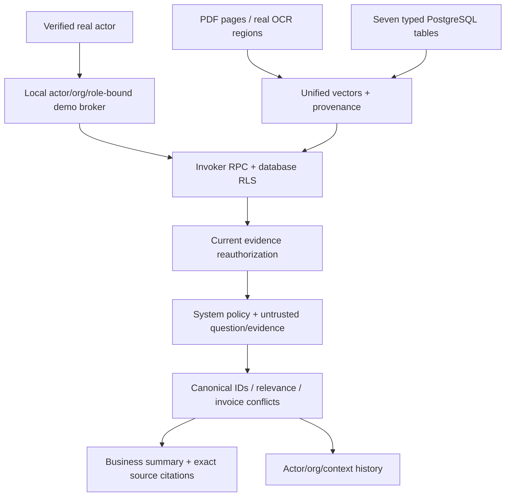

# Architecture — current local acceptance

Phase1 closeout: generation has credential/model-scoped metadata-only circuits with30–120s cooldown, one in-flight call/probe per model and preserved20s/45s budgets. Recent chat citations identify referents only after current scoped RLS reads; typed rows never expand into unrelated rows in a shared table document. Every business query still retrieves anew. Evaluation reuses local private JSON artifacts, atomic replacement and bounded archived run metadata; no evaluation database or distributed worker lock was added.

Next.js 16.4 / React 19, FastAPI, Supabase Auth/Postgres, pgvector 1536 and Gemini REST adapters. Five additive migrations are applied locally; hosted deployment is unverified and untouched.

The local browser forwards /api/v1 through a native Next rewrite configured by server-only API_INTERNAL_URL. It forwards the same bearer/context headers. FastAPI validates them; the web session proxy skips duplicate cookie refresh for these API paths. SSR protected pages still validate claims. Public login/callback/recovery routes remain available during Auth errors.

PDF/OCR source files are private local originals. Typed records are inserted and reread before indexing. The invoker structured-record policy compares current fields with indexed fields; changed/deleted records fail closed pending explicit reindex. No automatic reindex worker is implemented.

The API shares a lifespan HTTP client, embeds/retrieves once, bounds context to 16,000 content characters and permits at most two distinct verified configured generation models. Each submission rechecks current actor/context and RLS-visible rows. This narrows the revocation race but cannot make an external provider call atomic with the database.

History uses the existing query_history table and reconstructs responses from current citation rows and independently RLS-visible siblings. Exact invoice retrieval is scoped inside the invoker RPC, and zero-keyword matches receive no keyword-rank bonus. Small talk is explicitly labeled and rebuilt from its question. No implicit conversational-memory prompt is introduced. Metadata-only security events survive restarts. Delete uses one database transaction for evidence, grants, typed origin rows, audit and cleanup intent; private file cleanup follows and pending jobs drain on API startup.

See [acceptance](MASTER_ACCEPTANCE_CHECKLIST.md), [RAG](RAG_PIPELINE.md), [security](SECURITY_ARCHITECTURE.md), and [data model](DATA_MODEL.md).
