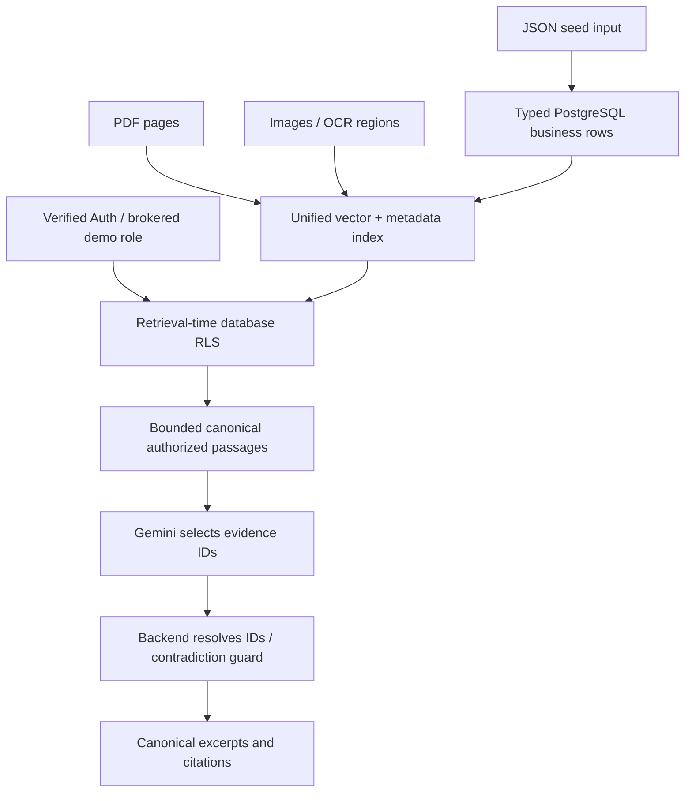

# Architecture

Current code: Next.js 16, FastAPI, Supabase Auth/Postgres, pgvector (1536 dimensions), and Gemini REST adapters. The existing invoker retrieval architecture is preserved. Database deployment is blocked in this pass; migration contents are implemented, not freshly applied.

Normal retrieval and source inspection use user sessions, never the service key. CEO role brokering is local-only and preserves the browser actor. Local privileged ingestion is separate and grants the selected role plus CEO.

Structured fixtures are seed inputs. The seed inserts actual typed rows, rereads PostgreSQL, derives canonical summaries, and embeds them. A restrictive chunk policy compares indexed fields against the current RLS-visible row; edits/deletion fail closed pending reindex. Composite document/org foreign keys prevent cross-tenant parent relationships.

FastAPI reuses a lifespan HTTP client, embeds once, retrieves once, caps canonical content at 16,000 characters, and permits one configured fallback on transient provider failures. No cross-user answer/evidence cache is introduced. Operational SSE events are server generated; only validated final excerpts are released. Auth, embedding, combined retrieval/ranking, generation, validation, history save, and total durations are measured where executed; separate ranking time is unmeasured.

History is persisted under the actor, organization, and active context. Reopen queries current grants and rebuilds citations/claim text. There is no implicit conversational-memory prompt: each question retrieves its own evidence.

Original uploads remain private local files. Opening an original requires a current document grant; a chunk-only grant never exposes sibling content. Browser bytes already viewed cannot be retroactively revoked. See [review status](REVIEW_NEEDED.md) for remaining proof and production boundaries.
